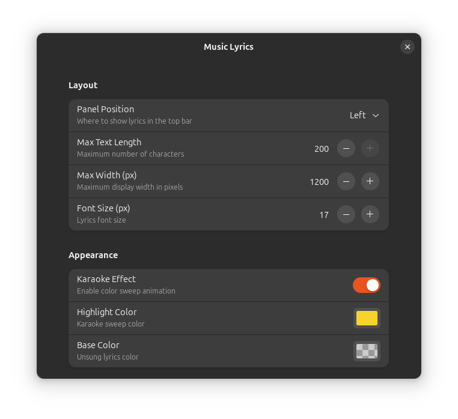

# SpotLine Enhanced

[English](README.md)

一个 GNOME Shell 扩展，在顶栏实时显示同步歌词，支持卡拉OK 逐字填充动画。

基于 [SpotLine](https://github.com/d3osaju/Spotline)（作者 deosaju）进行增强开发。


## 功能特性

- **卡拉OK 填充效果** — 歌词随播放进度从左到右逐渐高亮
- **网易云音乐歌词源** — 覆盖面广，对企业代理友好
- **歌词缓存** — 同一首歌重复播放时直接使用缓存，无需重复请求
- **精准定时** — 根据每行歌词的时间戳精确调度，而非固定间隔轮询
- **高度可定制** — 通过设置界面调整：
  - 字体大小
  - 最大显示宽度
  - 高亮颜色（卡拉OK 填充色）
  - 底色（未播放歌词颜色）
  - 卡拉OK 效果开关
  - 顶栏位置（左 / 中 / 右）
  - 最大文本长度
- **MPRIS 协议支持** — 兼容 Spotify、YouTube Music 及浏览器播放器

## 支持的 GNOME 版本

45、46、47、48

## 安装

### 从 GNOME Extensions 安装

访问 [extensions.gnome.org](https://extensions.gnome.org/) 搜索 "SpotLine Enhanced"。

### 从源码安装

```bash
git clone https://github.com/chenlee9876/spotline-enhanced.git
cd spotline-enhanced
./install.sh
```

安装后重启 GNOME Shell：
- **X11**：`killall -HUP gnome-shell`
- **Wayland**：注销后重新登录

## 配置

通过命令打开设置：

```bash
gnome-extensions prefs spotline-enhanced@chenlee9876
```

或使用 GNOME Extensions 应用 / Extension Manager。



## 与原版 SpotLine 的对比

| 特性 | SpotLine | SpotLine Enhanced |
|---|---|---|
| 歌词源 | LRCLIB | 网易云音乐 |
| HTTP 客户端 | Gio.File（不走代理） | Soup.Session（自动使用系统代理） |
| 动画效果 | 静态文本 | 卡拉OK 逐字填充 |
| 缓存 | 无 | 内存歌词缓存 |
| 定时策略 | 500ms 固定轮询 | 按歌词时间戳精确调度 |
| 可定制项 | 位置、文本长度 | + 字号、颜色、宽度、卡拉OK 开关 |

## 许可证

GPL-3.0 — 详见 [LICENSE](LICENSE)

基于 [SpotLine](https://github.com/d3osaju/Spotline)（作者 deosaju，GPL-3.0 许可）。
